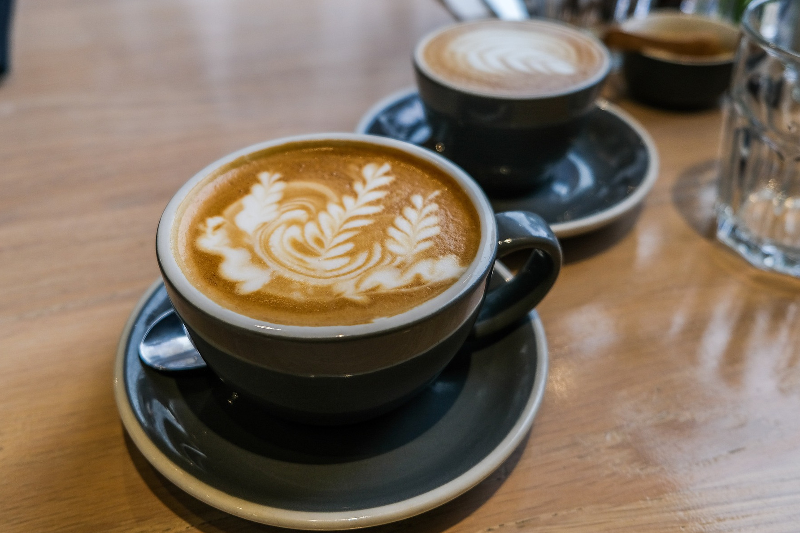
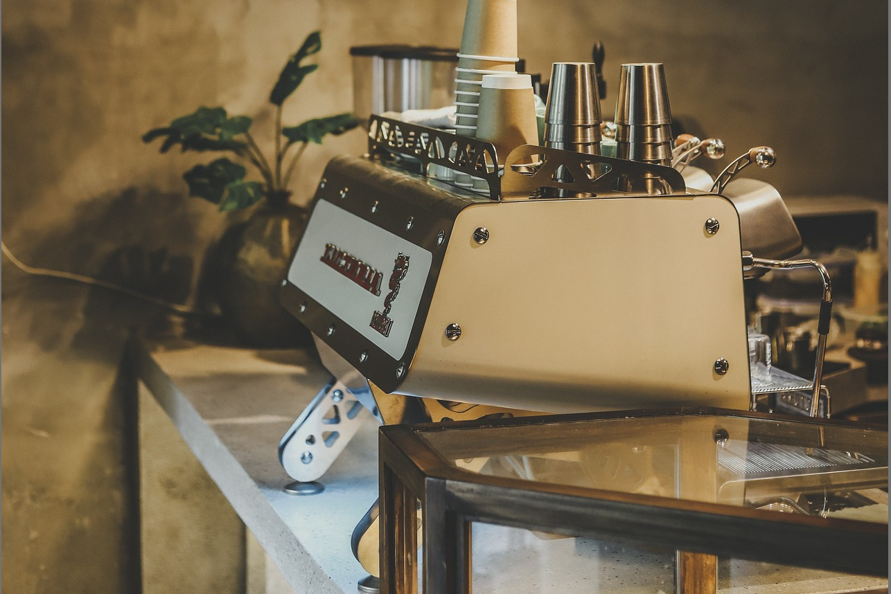
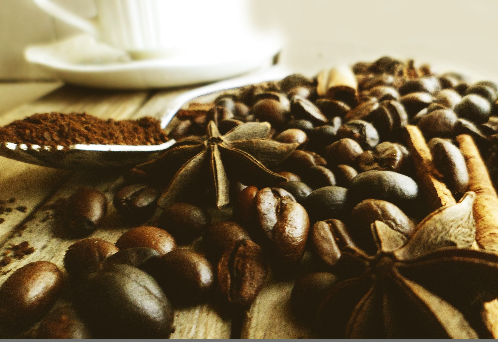
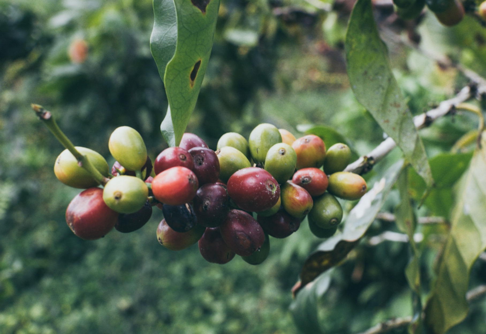
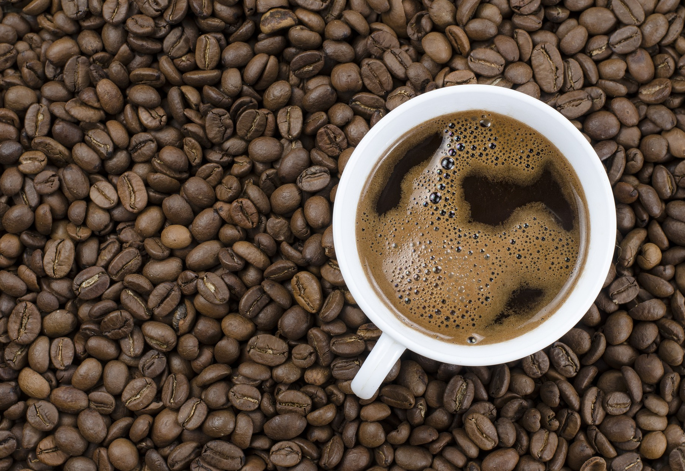
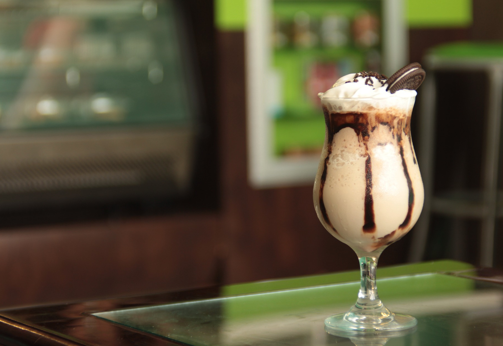
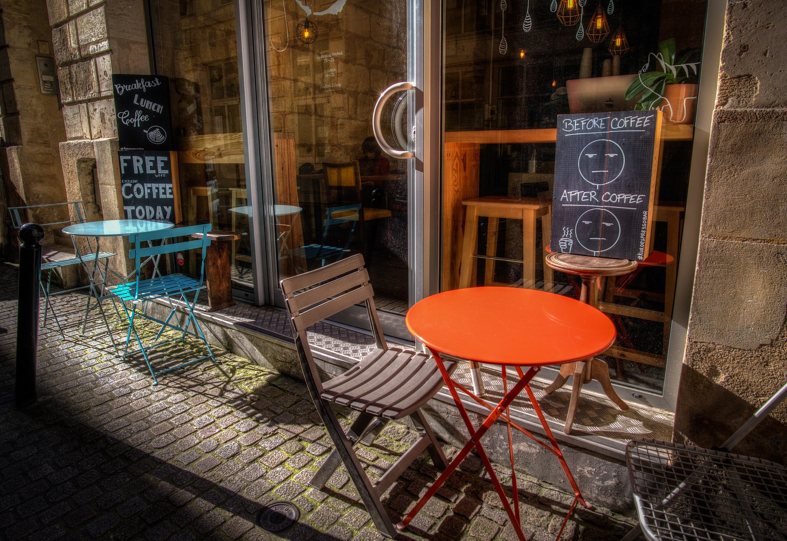
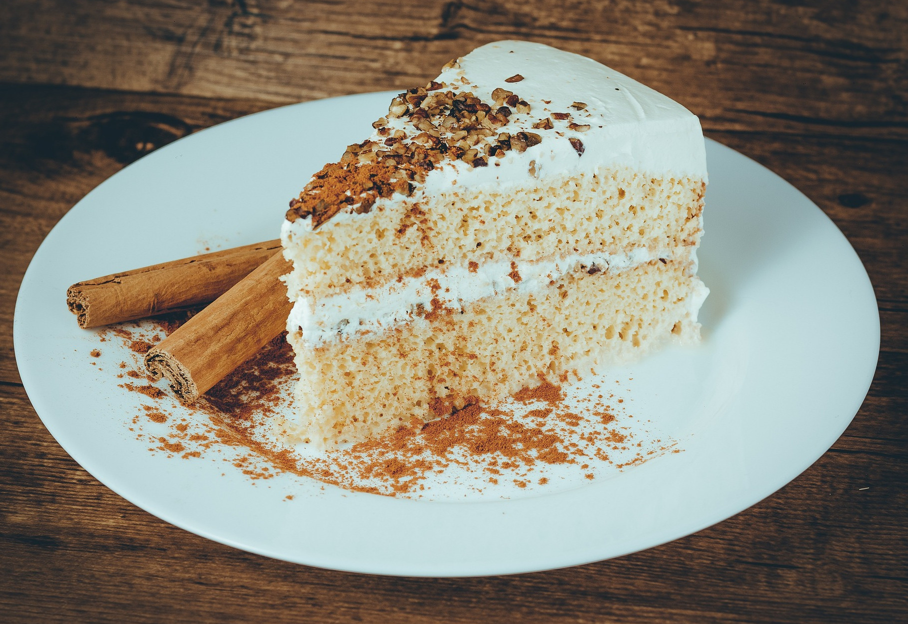
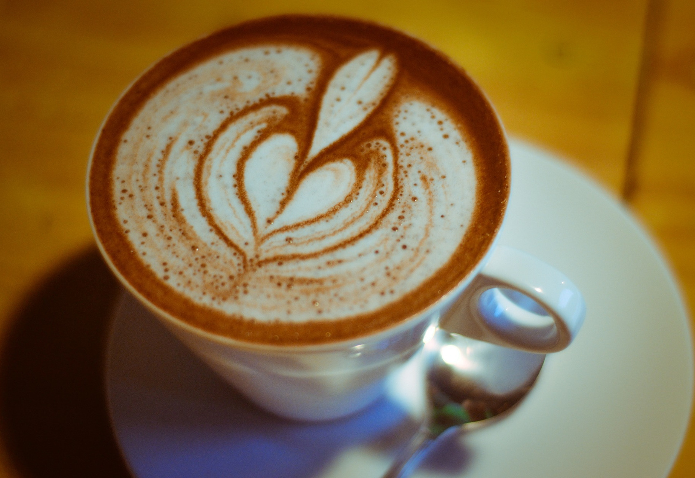
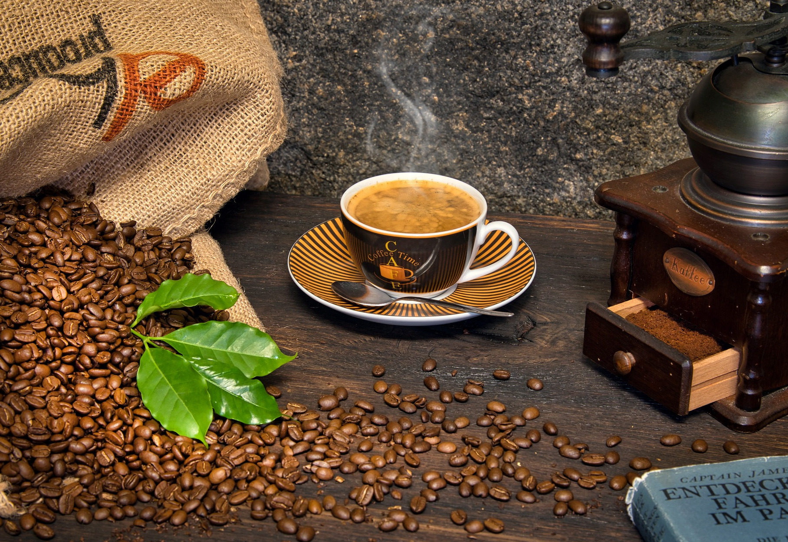

# Nazwa projektu: **Brewline**

## Spis treści
1. [Opis projektu](#opis-projektu)
2. [Tryb ciemny](#tryb-ciemny)
3. [Strona główna `index.html`](#strona-główna-indexhtml)
4. [Podstrona `about.html`](#podstrona-abouthtml)
5. [Podstrona `menu.html`](#podstrona-menuhtml)
6. [Podstrona `gallery.html`](#podstrona-galleryhtml)
7. [Podstrona `brewing.html`](#podstrona-brewinghtml)
8. [Podstrona `loyalty.html`](#podstrona-loyaltyhtml)
9. [Podstrona `contact.html`](#podstrona-contacthtml)

---

## Opis projektu

- Projekt wykonał **Pająk Piotr (131483)** Lab1.

- Strona została wykonana bez użycia dodatkowych narzędzi czy frameworków. Wszystkie linki do zdjęć/ikon znajdują się w pliku [sources.md](Brewline/Dokumentacja/sources.md).

- Strona internetowa promująca ofertę oraz usługi związane z kawą, stworzona z myślą o kawiarni lub przedsiębiorstwie specjalizującym się w branży kawowej.


### **Główne elementy projektu**

#### **Foldery i ich zawartość**

1. **`css`**:

   - Zawiera arkusz stylów (`style.css`), odpowiadający za układ graficzny oraz wygląd strony.

2. **`js`**:

   - Zawiera plik JavaScript (`script.js`), obsługujący interaktywne elementy strony, takie jak menu nawigacyjne czy dynamiczne efekty.

3. **`images`**:

   - Zawiera obrazy wykorzystywane na stronie, w tym zdjęcia kawy, ikony oraz logo.

     Przykładowe pliki:

     - `coffee-bg.jpg` (tło dla sekcji `hero`),
     - `logo.png` (logo firmy),
     - `favicon.png` (ikona strony).
     
     

### **Funkcje i funkcjonalności**

#### **1. Nawigacja**

- Główne menu z kategoriami (Home, About, Menu, Gallery, Brewing, Loyalty, Contact).
- Wersja mobilna obsługiwana przez przycisk hamburgera.

#### **2. Responsywny design**

- Projekt przystosowany do różnych urządzeń dzięki CSS (np. `@media` queries).

#### **3. Interaktywność**

- Za pomocą JavaScript obsługiwane są dynamiczne funkcje, takie jak:
  - 'Hamburger' menu,
  - Tryb ciemny.

#### **4. Stylizacja**

- Wykorzystano plik `style.css` do implementacji spójnej palety kolorów, układów i czcionek.


### **Technologie użyte w projekcie**

1. **HTML5**: Struktura strony.
2. **CSS3**: Stylizacja i responsywny design.
3. **JavaScript**: Interaktywność oraz dynamiczne elementy strony.
4. **Grafika**: Obrazy w formatach PNG, JPG oraz SVG.


---

## Tryb ciemny

Strona została wykonana z opcją włączenia trybu ciemnego. Po włączeniu tej opcji na jednej z podstron, wszystkie inne podstrony automatycznie wyświetlane są w trybie ciemnym (funkcjonalność działa na przeglądarkach opartych o Chromium). Szczegóły implementacji oraz animacje przełączania opisano poniżej.

### Instrukcja obsługi

Aby włączyć tryb ciemny, należy najechać na element listy `Preferences` w nawigacji i przełączyć przełącznik. Do animacji przycisku użyto `CSS`, a do zmiany stylów `JavaScript`.

---


Kod przełącznika:

HTML

```html
<li class="dropdown">
                    <a href="#" class="dropbtn">Preferences</a>
                    <ul class="dropdown-content">
                        <li class="dark-mode-toggle">
                            <!--<p>Toggle Dark Mode</p>-->
                            <span class="sun-icon">
                                
                            </span>
                            <input type="checkbox" id="dark-mode-toggle" aria-label="Toggle dark mode">
                            <label for="dark-mode-toggle" class="switch"></label>
                            <span class="moon-icon">
                                
                            </span>
                        </li>
                    </ul>
                </li>
```

CSS

```css
/* Dark Mode Toggle */
.dark-mode-toggle {
    display: flex;
    align-items: center;
    justify-content: center;
    gap: 10px;
    margin-left: auto; /* Push the toggle to the far right */
    flex-shrink: 0; /* Prevent shrinking of the toggle */
}

.dark-mode-toggle input[type="checkbox"] {
    display: none; /* Hide the checkbox */
}

.dark-mode-toggle .switch {
    width: 50px;
    height: 26px;
    background-color: #ccc;
    border-radius: 50px;
    position: relative;
    cursor: pointer;
    transition: background-color 0.3s ease;
    border: 2px solid #aaa;
    overflow: hidden;
}

.dark-mode-toggle .switch::before {
    content: '';
    width: 20px;
    height: 20px;
    background-color: white;
    border-radius: 50%;
    position: absolute;
    top: 50%;
    transform: translateY(-50%);
    left: 3px;
    transition: left 0.3s ease;
}

.dark-mode-toggle input[type="checkbox"]:checked + .switch::before {
    left: calc(100% - 23px); /* Move to the right inside the switch */
}

.dark-mode-toggle .sun-icon, .dark-mode-toggle .moon-icon {
    width: 20px;
    height: 20px;
}

.dark-mode-toggle .sun-icon {
    order: 0; /* Make the sun appear after the toggle */
}

.dark-mode-toggle .moon-icon {
    order: 2; /* Make the moon appear before the toggle */
}
```

JS

```javascript
function applyDarkMode() {
        if (localStorage.getItem('darkMode') === 'enabled') {
            document.body.classList.add('dark-mode');
        } else {
            document.body.classList.remove('dark-mode');
        }
    }

    // Apply dark mode on page load
    applyDarkMode();

    // Get the checkbox element for dark mode toggle
    const darkModeSwitch = document.getElementById('dark-mode-toggle');

    // Update toggle state
    if (darkModeSwitch) {
        darkModeSwitch.checked = localStorage.getItem('darkMode') === 'enabled';
        // Event listener to toggle dark mode
        darkModeSwitch.addEventListener('change', () => {
            if (darkModeSwitch.checked) {
                localStorage.setItem('darkMode', 'enabled');
                document.body.classList.add('dark-mode');
            } else {
                localStorage.setItem('darkMode', 'disabled');
                document.body.classList.remove('dark-mode');
            }
        });
    }
```

 

## Strona główna `index.html`

Tryb jasny:


Tryb ciemny:


Na stronie głównej znajdują się sekcje:
- Hero (powitanie i główne logo strony),
- Slider (pokaz najnowszych zdjęć),
- Locations (lokalizacje kawiarni),
- Testimonials (opinie klientów),
- Events (nadchodzące wydarzenia),
- Newsletter (możliwość zapisania się do newslettera - formularz).

**Na każdej ze stron (podstron) znajduje się ten sam panel nawigacyjny, elementy stron są responsywne.**


Zawiera on logo wykonane w programie GIMP (z użyciem favicon) oraz wycentrowaną listę z linkami do poszczególnych podstron. Aktualnie wyświetlana strona jest podkreślona dla większej przejrzystości. 


Kod panelu nawigacyjnego:

HTML

```html
<ul class="menu hidden">
                <li><a href="index.html"><u>Home</u></a></li>
                <li><a href="about.html">About</a></li>
                <li><a href="menu.html">Menu</a></li>
                <li><a href="gallery.html">Gallery</a></li>
                <li><a href="brewing.html">Brewing</a></li>
                <li><a href="loyalty.html">Loyalty</a></li>
                <li><a href="contact.html">Contact</a></li>
                <!-- Dark Mode Toggle Inside Menu -->
                <li class="dropdown">
                    <a href="#" class="dropbtn">Preferences</a>
                    <ul class="dropdown-content">
                        <li class="dark-mode-toggle">
                            <!--<p>Toggle Dark Mode</p>-->
                            <span class="sun-icon">
                                
                            </span>
                            <input type="checkbox" id="dark-mode-toggle" aria-label="Toggle dark mode">
                            <label for="dark-mode-toggle" class="switch"></label>
                            <span class="moon-icon">
                                
                            </span>
                        </li>
                    </ul>
                </li>                
            </ul>
```

Menu jest responsywne, w przypadku, gdy elementy nie będą się mieściły na ekranie, menu jest ukrywane i pokazywany jest 'hamburger' button, który po kliknięciu wyświetla menu w pozycji pionowej.


Fragment kodu, który jest odpowiedzialny za responsywność menu, 'hamburger' button oraz pionowe wyświetlanie listy:

HTML

```html
<button class="hamburger" aria-label="Toggle navigation">
                <span></span>
                <span></span>
                <span></span>
            </button>
```

CSS

```css
/* Header Navigation */
header nav {
    display: flex;
    align-items: center;
    justify-content: space-between; /* Space between logo, menu, and toggle */
    background: #503C3C;
    padding: 15px 40px;
    position: relative;
    flex-wrap: wrap; /* Allow wrapping to prevent overlap */
}

nav .logo img {
    height: 40px;
    width: auto;
}

nav ul {
    display: flex;
    justify-content: center;
    align-items: center;
    list-style: none;
    padding: 0;
    margin: 0 auto; /* Center menu items horizontally */
    flex: 1; /* Allow the menu to take up the middle space */
}

nav ul li {
    margin: 0 15px;
}

nav ul li a {
    color: #A87C7C;
    text-decoration: none;
    font-size: 16px;
    transition: color 0.3s;
}

nav ul li a:hover {
    color: #7E6363;
}

/* Responsive Navigation */
@media (max-width: 768px) {
    header nav {
        flex-direction: column; /* Stack items vertically */
        align-items: center; /* Center all items */
        padding: 15px;
    }

    nav ul {
        flex-direction: column;
        gap: 10px;
        width: 100%;
    }

    nav ul li {
        margin: 5px 0;
    }

    .dark-mode-toggle {
        margin-top: 10px; /* Place the toggle below the menu */
        align-self: flex-end; /* Align it to the right of the header */
    }
}

/* Hamburger menu styles */
.hamburger {
    display: none; /* Hide hamburger by default */
    flex-direction: column;
    gap: 5px;
    border: none;
    background: none;
    cursor: pointer;
    padding: 10px;
}

.hamburger span {
    width: 25px;
    height: 3px;
    background: #A87C7C;
    border-radius: 3px;
    transition: transform 0.3s ease, background-color 0.3s ease;
}
/* Hamburger animation for active */
.hamburger.active span:nth-child(1) {
    transform: rotate(45deg) translate(5px, 6px);
}

.hamburger.active span:nth-child(2) {
    opacity: 0; /* Hide middle bar */
}

.hamburger.active span:nth-child(3) {
    transform: rotate(-45deg) translate(5px, -6px);
}

/* Responsive nav menu */
@media (max-width: 885px) {
    .hamburger {
        display: flex; /* Show hamburger on smaller screens */
    }

    nav ul.menu {
        display: none; /* Hide menu at first */
        flex-direction: column; /* Stack menu items vertically */
        width: 100%;
        background: #503C3C;
        position: absolute;
        top: 60px;
        left: 0;
        z-index: 100;
        padding: 10px 0;
    }

    .dark-mode nav ul.menu {
        background: #222222;
    }

    nav ul.menu.active {
        display: flex; /* Show menu when active */
    }

    nav ul.menu li {
        margin: 10px 0;
        text-align: center;
    }

    nav ul.menu li a {
        font-size: 18px;
    }
}
/* Show dropdown when hamburger is clicked in smaller screens */
@media (max-width: 855px) {
    nav ul .dropdown-content {
        position: static; /* Remove absolute positioning */
        width: 100%; /* Make dropdown take full width */
        display: none; /* Hide by default on smaller screens */
    }

    nav ul .dropdown.active .dropdown-content {
        display: block; /* Show on active state */
    }
}
```

JS

```javascript
// Hamburger menu toggle
    const hamburgerMenuButton = document.querySelector('.hamburger');
    const menuList = document.querySelector('nav ul');

    if (hamburgerMenuButton && menuList) {
        // Event listener to toggle the menu visibility
        hamburgerMenuButton.addEventListener('click', () => {
            menuList.classList.toggle('active');
            hamburgerMenuButton.classList.toggle('active');
        });
    }
```


Poniżej mamy sekcję 'hero', która jest logiem/powitaniem strony oraz sekcję 'slider' odpowiedzialną za pokaz slajdów (najnowsze zdjęcia) na stronie głównej.


Kod `hero` oraz sekcji `slider`:

HTML

```html
<section class="hero">
            <h1>Welcome to Brewline</h1>
            <p>Your daily dose of perfect coffee.</p>
        </section>
        <br>

        <section class="slider-container">
            <h1>Our Newest Photos</h1>
            <div class="slider">
                <div class="slide"></div>
                <div class="slide"></div>
                <div class="slide"></div>
                <div class="slide"></div>
                <div class="slide"></div>
                <div class="slide"></div>
                <div class="slide"></div>
                <div class="slide"></div>
                <div class="slide"></div>
                <div class="slide"></div>
                <div class="slide"></div>
                <div class="slide"></div>
                <div class="slide"></div>
                <div class="slide"></div>
                <div class="slide"></div>
                <div class="slide"></div>
                <div class="slide"></div>
                <div class="slide"></div>
                <div class="slide"></div>
                <div class="slide"></div>
                <div class="slide"></div>
                <div class="slide"></div>
                <div class="slide"></div>
                <div class="slide"></div>
                <div class="slide"></div>
                <div class="slide"></div>
                <div class="slide"></div>
                <div class="slide"></div>
                <div class="slide"></div>
                <div class="slide"></div>
            </div>
            
        </section>
```

CSS

```css
/* Hero Section */
.hero {
    text-align: center;
    padding: 100px 20px;
    background: url('../images/coffee-bg.jpg') no-repeat center center/cover;
    color: #F9F9F9;
    transition: background-color 0.3s ease;
}

.hero h1 {
    font-size: 3rem;
    margin-bottom: 10px;
    color: #A87C7C;
}

.hero p {
    font-size: 1.2rem;
    color: #F9F9F9;
}

/* Responsive Hero Section */
@media (max-width: 768px) {
    .hero h1 {
        font-size: 2.5rem;
    }
    .hero p {
        font-size: 1rem;
    }
}


/* Slider container */
.slider-container {
    width: 100%; /* Full width */
    height: 300px; /* Adjust height to fit images */
    overflow: hidden; /* Hides the extra content outside the viewport */
    position: relative;
}

/* Slider element */
.slider {
    display: flex;
    animation: slide 120s linear infinite; /* Slide duration */
}

/* Slide */
.slide {
    flex: 0 0 auto; /* Allow images to shrink */
    width: 50%; /* Slide takes 50% of the container width */
}

/* Images inside the slide */
.slider img {
    width: 100%; /* Image fits the slide */
    height: 300px; /* Height */
    object-fit: cover; /* Images cover the area */
}

/* Keyframes for smooth scrolling */
@keyframes slide {
    0% {
        transform: translateX(0); /* Start position */
    }
    100% {
        transform: translateX(-1500%); /* 30 images * 50% width */
    }
}
```

Następnie mamy skecję 'locations', która zawiera lokalizację kawiarni (do wygenerowania mapy użyto narzędzia: [googlemapsgenerator](https://www.googlemapsgenerator.com/en/)).


W kolejnej sekcji (`testimonials`) są zawarte opinie klientów. Po najechaniu myszką następuje małe 'powiększenie' oraz zmieniany jest kolor tła dla poszczególnych opinii. W trybie ciemnym zmieniany jest też kolor dla `border`.

Tryb jasny:


Tryb ciemny:


Kod dla `testimonials`:

HTML

```html
<section id="testimonials">
            <h1>What Our Customers Say</h1>
            <div class="testimonial">
                
                <p>"Brewline has the best coffee in town! I can't start my day without it."</p>
                <p>Jane Doe</p>
            </div>
            <div class="testimonial">
                
                <p>"Amazing atmosphere and even better coffee. Highly recommend!"</p>
                <p>John Smith</p>
            </div>
        </section>
```

CSS

```css
/* Testimonials Section */
.testimonials {
    padding: 20px;
    margin-bottom: 40px;
    background: #F7EDE1;
    border-left: 5px solid #A87C7C;
    border-radius: 10px;
}

.testimonials h2 {
    font-size: 1.8rem;
    color: #6B4226;
    margin-bottom: 15px;
    text-align: center;
}

.testimonials p {
    font-style: italic;
    color: #4A3C31;
    margin: 10px 0;
    text-align: center;
}

/* Dark Mode */
body.dark-mode .testimonials {
    background: #3E3E3E;
    border-left: 5px solid #F7C873;
}

body.dark-mode .testimonials p {
    color: #D3D3D3;
}
/* Style for the testimonials */
#testimonials {
    padding: 20px;
    background-color: #f5f5f5;
    border-radius: 8px;
}

.dark-mode #testimonials {
    border: 1px solid #F7C873;
    background-color: #3E3E3E;
    color: #F7C873;
}

/* Style for each review container */
.testimonial {
    position: relative;
    padding: 15px;
    margin-bottom: 15px;
    background-color: #ffffff;
    border: 1px solid #ddd;
    border-radius: 8px;
    transition: background-color 0.3s ease-in-out, transform 0.2s ease-in-out;
}

.dark-mode .testimonial {
    background-color: #3E3E3E;
}

.dark-mode #testimonials:hover {
    border-color: #E8B265;
}

.dark-mode .testimonial:hover {
    background-color: #4F4F4F;
}

/* Change background color on hovering over review */
.testimonial:hover {
    background-color: #f9f9f9;
    transform: scale(1.02); /* Zoom effect */
}

/* Style for the text inside review */
.testimonial p {
    margin: 0;
    color: #555;
    font-style: italic;
}

/* Style for the review author's name */
.testimonial p:last-child {
    position: absolute;
    bottom: 10px;
    right: 10px;
    margin: 0;
    text-align: right;
    font-weight: bold;
    margin-top: 5px;
    color: #7a4e2a;
}

.dark-mode .testimonial p:last-child {
    color: #F7C873;
}

/* Container for each review */
.testimonial {
    display: flex; /* Align profile photos and text horizontally */
    align-items: center; /* Vertically align the photo with the text */
    padding: 15px;
    margin-bottom: 15px;
    background-color: #ffffff;
    border: 1px solid #ddd;
    border-radius: 8px;
    transition: background-color 0.3s ease-in-out, transform 0.2s ease-in-out;
}

/* Profile photo styling */
.profile-photo {
    width: 50px; /* Set photo size */
    height: 50px; /* Width for circle */
    border-radius: 50%; /* Make it circular */
    object-fit: cover; /* Image scaling */
    margin-right: 15px; /* Space between photo and text */
    border: 2px solid #ddd;
}

/* Text container for the review */
.review-text {
    flex: 1; /* Take up the remaining space next to the profile photo */
}

/* Text styling for review */
.review-text p {
    margin: 0;
    color: #555;
    font-style: italic;
}

.review-text p:last-child {
    text-align: right;
    font-weight: bold;
    margin-top: 5px;
    color: #7a4e2a;
}

/* Hover effect for individual reviews */
.testimonial:hover {
    background-color: #f9f9f9;
    transform: scale(1.02);
}
```

Pod koniec umieszczone są sekcje dotyczące nadchodzących eventów oraz formularz do newslettera. Pole `input` w formularzu używa walidacji adresu e-mail. Border pola `input` zmienia kolor po kliknięciu, a przycisk `Subscribe` zmienia kolor po najechaniu.


Stopka dla każdej podstrony jest taka sama. Kolor tła jest zmieniany po przełączeniu na tryb ciemny. Stopka zawiera znak copyright, nazwę projektu, imię i nazwisko osoby wykonującej projekt oraz linki do social media t.j. [Facebook](https://facebook.com), [Bluesky](https://bsky.app/) oraz [Twitter](https://twitter.com).

Tryb jasny:


Tryb ciemny:


---

## Podstrona `about.html` 

Zawiera podstawowe informacje dotyczące kawiarni `Brewline`.

Tryb jasny:


Tryb ciemny:


---

## Podstrona `menu.html`

Podstrona przedstawia menu kawiarni w formie tabeli z opisami produktów. W trybie ciemnym kolor tekstu oraz tło są dostosowane.

Tryb jasny:


Tryb ciemny:


Kod dla `menu`:

HTML

```html
<h1>Our Menu</h1>
            <br>

            <h2>Coffee Classics</h2>
            <table class="menu-table">
                <tr>
                    <td><strong>Espresso:</strong> $3.50</td>
                    <td>A bold and concentrated shot of pure coffee, perfect for those who enjoy an intense flavor experience.</td>
                </tr>
                <tr>
                    <td><strong>Americano:</strong> $3.00</td>
                    <td>Smooth and aromatic, made by blending a rich espresso with hot water for a milder taste.</td>
                </tr>
                <tr>
                    <td><strong>Latte:</strong> $4.00</td>
                    <td>A creamy combination of espresso and steamed milk, topped with a gentle layer of foam.</td>
                </tr>
                <tr>
                    <td><strong>Cappuccino:</strong> $4.00</td>
                    <td>Classic balance of espresso, steamed milk, and velvety foam for a luxurious finish.</td>
                </tr>
                <tr>
                    <td><strong>Mocha:</strong> $4.50</td>
                    <td>A decadent blend of espresso, steamed milk, and rich chocolate, topped with whipped cream.</td>
                </tr>
            </table>
```

CSS

```css
/* Basic Styles for Table */
.menu-table {
    width: 100%;
    border-collapse: collapse; /* No extra space between cells */
    margin-bottom: 20px;
}

/* Hide table borders */
.menu-table td {
    border: none;
    padding: 10px;
    vertical-align: top;
}

/* Style for the menu items (products) */
.menu-table td:first-child {
    font-weight: bold;
    width: 150px; /* Space for the names */
}

/* Style for descriptions */
.menu-table td:nth-child(2) {
    color: #6f4f4b;
}

.menu-table tr {
    margin-bottom: 10px;
}

body.dark-mode .menu h1 {
    color: #F7C873;
}

body.dark-mode .menu h2 {
    color: #E8B265;
}

/* Stacking for smaller screens */
@media (max-width: 768px) {
    .menu-table {
        display: block; /* Better responsiveness */
    }

    .menu-table td {
        display: block;
        width: 100%;
        box-sizing: border-box;
    }

    /* Adjust font sizes for smaller screens */
    .menu-table td:first-child {
        font-size: 1.1rem;
        margin-bottom: 5px;
    }

    .menu-table td:nth-child(2) {
        font-size: 1rem;
        margin-bottom: 10px;
    }
}

/* Adjust for even smaller screens */
@media (max-width: 480px) {
    .menu-table td:first-child {
        font-size: 1rem; /* Smaller font for item names */
    }

    .menu-table td:nth-child(2) {
        font-size: 0.9rem; /* Smaller font for descriptions */
    }
}
```

---

## Podstrona `gallery.html`

Galeria zdjęć z efektem powiększania po najechaniu kursorem. Strona jest w pełni responsywna.

Tryb jasny:


Responsywność:


Tryb ciemny:


Kod dla `gallery`:

HTML

```html
<section class="gallery">
            <h1>Our Gallery</h1><br>
            <div>
                
                
                
                
                
                
                
                
                
                
                
                
                
                
                
                
                
                
                
                
                
                
                
                
                
                
                
                
                
                
            </div>
        </section>
```

CSS

```css
/* Image Gallery */
.gallery img {
    width: 100%; /* Full width */
    max-width: 200px;
    border: 5px solid #A87C7C;
    border-radius: 10px;
    margin-bottom: 15px;
    margin-left: 4px;
    transition: transform 0.3s, border-color 0.3s;
}

.gallery img:hover {
    transform: scale(1.05);
    border-color: #7E6363;
}

.gallery {
    display: flex;
    flex-wrap: wrap;
    justify-content: center;
    gap: 15px;
}

/* Responsive Gallery */
@media (max-width: 768px) {
    .gallery img {
        max-width: 150px; /* Smaller images for smaller screens */
    }
}
body.dark-mode .gallery h1 {
    color: #F7C873;
}
body.dark-mode .gallery img{
    border: 5px solid #3E3232;
}

```


## Podstrona `brewing.html`

Opis różnych technik parzenia kawy wraz z odnośnikami do zewnętrznych artykułów.

Tryb jasny:


Tryb ciemny:


Style dla `brewing`:

```css
body.dark-mode .brewing li,
body.dark-mode .brewing p {
    color: #D3D3D3;
}

body.dark-mode .brewing li:hover {
    color: #F7C873;
}

body.dark-mode .brewing h1 {
    color: #F7C873;
}

body.dark-mode .brewing h2 {
    color: #E8B265;
}

body.dark-mode .brewing a {
    color: #A8DADC;
    text-decoration: none;
}

body.dark-mode .brewing a:hover {
    color: #FFA07A;
}

body.dark-mode .brewing a:visited {
    color: #A1A1A1;
}
```

---

## Podstrona `loyalty.html`

Informacje na temat programu lojalnościowego oraz sekcja FAQ z najczęściej zadawanymi pytaniami.

Tryb jasny:


Tryb ciemny:


Style dla `loyalty`:

```css
body.dark-mode .loyalty h1 {
    color: #F7C873;
}

body.dark-mode .loyalty h2 {
    color: #E8B265;
}

body.dark-mode .faq h2 {
    color: #E8B265;
}

body.dark-mode .loyalty li,
body.dark-mode .loyalty p {
    color: #D3D3D3;
}
body.dark-mode .faq li,
body.dark-mode .faq p {
    color: #D3D3D3;
}
```

---

## Podstrona `contact.html`

Podstrona zawiera formularz używany do kontaktu klienta z kawiarnią. Zawiera dwa pola `input` oraz jedno `textarea`. Po kliknięciu na pole formularza zmieniany jest jego kolor obramowania (również w trybie ciemnym). Po najechaniu na przycisk zmienia on kolor tła. Formularz również sprawdza poprawność e-mail, wszystkie pola są wymagane. Zablokowano możliwość zmieniania rozmiaru `textarea`.

Tryb jasny:


Tryb ciemny:


Kod dla `contact`:

HTML

```html
<section class="contact">
            <h1>Contact Us</h1>
            <p>If you have any questions, feel free to reach out to us! We would love to hear from you.</p>
            
            <form action="#" method="post">
                <label for="name">Your Name</label>
                <input type="text" id="name" name="name" placeholder="Enter your name" required>

                <label for="email">Your Email</label>
                <input type="email" id="email" name="email" placeholder="Enter your email" required>

                <label for="message">Your Message</label>
                <textarea id="message" name="message" rows="5" placeholder="Enter your message" required></textarea>

                <button type="submit" class="btn">Send Message</button>
                <button type="reset" class="btn">Clear Form</button>
            </form>
        </section>
```

CSS

```css
body.dark-mode .contact h1 {
    color: #F7C873;
}

body.dark-mode .contact p {
    color: #D3D3D3;
}

/* Form Elements */
form input, form textarea {
    width: 100%;
    padding: 10px;
    margin: 10px 0;
    border: 1px solid #7E6363;
    background-color: #D4B89F;
    border-radius: 5px;
}

form input:focus, form textarea:focus {
    border-color: #503C3C;
    outline: none;
}

textarea {
    resize: none;
}
```

